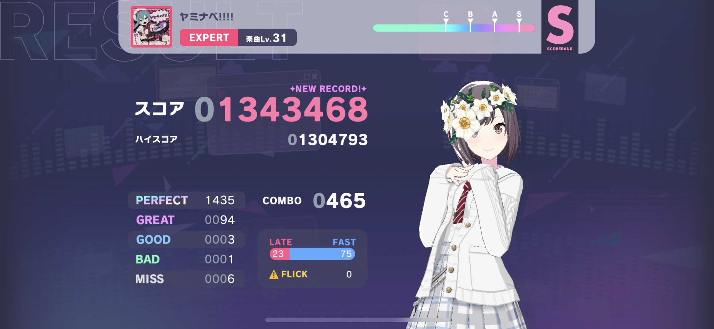

# pjskjs

Utilities of Project SEKAI COLORFUL STAGE! feat. Hastune Miku.

## Installation

```console
git clone https://github.com/shinich39/pjskjs
cd pjskjs
npm install
```

## Usage

```js
import pjsk from 'pjskjs'; // esm
```

- Music list

```js
await pjsk.update();
// update music list.

const res = pjsk.getMusics();
// get all musics

const res = pjsk.getDiffs();
// get all musicDifficuties

const res = pjsk.findMusic("Tell Your World"); 
// {
//   acc: 1,
//   music: {
//     "id": 1,
//     "seq": 1100101,
//     "releaseConditionId": 1,
//     "categories": [
//       "mv"
//     ],
//     "title": "Tell Your World",
//     "pronunciation": "てるゆあわーるど",
//     "creatorArtistId": 1,
//     "lyricist": "kz",
//     "composer": "kz",
//     "arranger": "kz",
//     "dancerCount": 1,
//     "selfDancerPosition": 0,
//     "assetbundleName": "jacket_s_001",
//     "liveTalkBackgroundAssetbundleName": "bg_livetalk_default_002",
//     "publishedAt": 1560148031000,
//     "releasedAt": 1326812400000,
//     "liveStageId": 1,
//     "fillerSec": 9.0,
//     "isNewlyWrittenMusic": false,
//     "isFullLength": false
//   },
// }

const res = pjsk.findDiff(musicId, difficulty); 
// {
//   "id": 1,
//   "musicId": 1,
//   "musicDifficulty": "easy",
//   "playLevel": 5,
//   "releaseConditionId": 1,
//   "totalNoteCount": 220
// }
```

- Game result recognize



```js
const res = pjsk.recognize(filePath);
// {
//   hash: 'fVw09w0g8dwcgwh2000000d$GaawEaaaya20w0000000',
//   isChallenge: false,
//   title: 'ヤミナベ!!!!',
//   difficulty: 'EXPERT',
//   playLevel: 31,
//   totalNoteCount: 1539,
//   condition: 'LIVE CLEAR',
//   judgements: {
//     perfect: 1435,
//     great: 94,
//     good: 3,
//     bad: 1,
//     miss: 6
//   }
//   music: {
//     id: 329,
//     seq: 1125501,
//     releaseConditionId: 5,
//     categories: [ 'image' ],
//     title: 'ヤミナベ!!!!',
//     pronunciation: 'やみなべ',
//     creatorArtistId: 23,
//     lyricist: 'cosMo＠暴走P',
//     composer: 'cosMo＠暴走P',
//     arranger: 'cosMo＠暴走P',
//     dancerCount: 1,
//     selfDancerPosition: 0,
//     assetbundleName: 'jacket_s_329',
//     liveTalkBackgroundAssetbundleName: 'bg_livetalk_default_002',
//     publishedAt: 1677909600000,
//     releasedAt: 1653577200000,
//     liveStageId: 1,
//     fillerSec: 9.010000228881836,
//     isNewlyWrittenMusic: false,
//     isFullLength: false
//   },
//   musicDifficulty: {
//     id: 1644,
//     musicId: 329,
//     musicDifficulty: 'expert',
//     playLevel: 31,
//     releaseConditionId: 1,
//     totalNoteCount: 1539
//   },
// }
```

## References

- [sekai-master-db-diff](https://github.com/Sekai-World/sekai-master-db-diff)